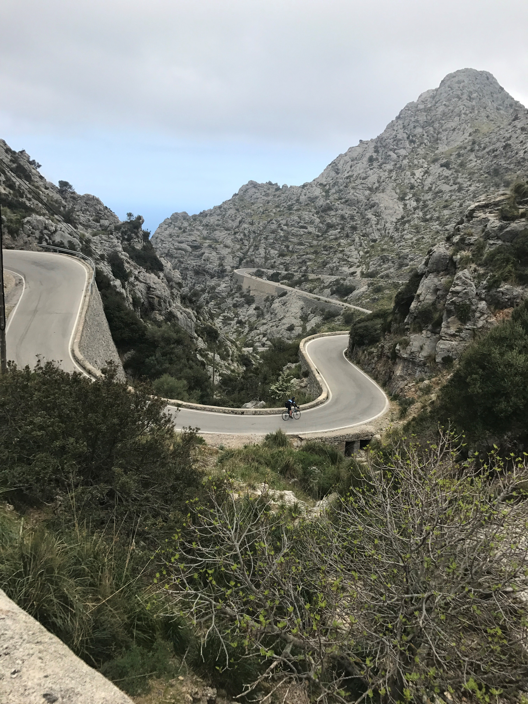

# BullysBikeStuff
Last Updated : 6/01/2025 

## Sportive Portals 
Euro Sportives 
http://www.granfondoguide.com/Events/SportiveCalendar?region=Europe&country=All&subregion=All&subsubregion=All

Mainly UK
https://www.sportive.com/

Gran Fondo World Tour
https://www.granfondoworldtour.com/

Gravel Series
https://www.ukcyclingevents.co.uk/events/

## 2025 Long List

### Misc 
Herts Reliability Ride Series \
https://verulamcc.org.uk/club-runs-a-activities/local-events/spring-classics

### February 
* Verulum CC Reliability ride - 23rd Feb \
https://verulamcc.org.uk/club-runs-a-activities/local-events/verulam-reliability-ride

### April 
- [ ]  Flandrien Challenge 
        https://www.cyclinginflanders.cc/flandrien-challenge

- [ ]  Amstel Gold Sportive - April 19th 
    https://www.amstel.nl/amstelgoldrace/toerversie

* Liege Bastogne Liege - April 26
https://lblchallenge.be/en/register/

### May 
* Giro D'Uterecht - May 11 
https://www.girodutrecht.nl/

## June 
* UCI Gravel / Fondo Swiss - June 27/8/9th
https://ucigravelsuisse.com/en/

### July 
- [ ] Lincoln-Tugby Challenge - July 13th
https://www.itpevents.co.uk/giant-lincoln-tugby-challenge

## Medical Cert Providers (required for France / Italy)
GBP 49.00 2/9/2021
https://www.doctap.co.uk/services/doctors-letter/

Sample form:
https://images.sportstoursinternational.co.uk/wp-content/uploads/2018/08/Health-Certificate-STRADE-BIANCHE-ENG.pdf

## 2024
### September 
* Bodensee Radmarathon
https://www.strava.com/activities/12349028157

### August
* Tour Des Stations Short
https://www.strava.com/activities/12349028157

## 2023
Nout :disappointed:

## 2022 

### August 2022

* Tour Des Stations Gran Fondo
https://www.strava.com/activities/7593375094

### June 2022
* Tour of Cambridgeshire Gran Fondo
https://www.strava.com/activities/7296912349

### April 2022
* Mallorca 312 
https://www.strava.com/activities/7066643186

### March 2022
* E3 Cyclo - 27/03/2022   
https://www.strava.com/activities/6891150345

* Ghent Wevelgem Cyclo - 26/03/2022
https://www.strava.com/activities/6886864735

* Paris Nice Sportive - 12/03/2022
https://www.strava.com/activities/6811829587

* Verlum CC Reliability Ride - 06/03/2022
https://www.strava.com/activities/6782751775

### Feb 2022 
* OomLoop Sportive - 27/02/2022
https://www.strava.com/activities/6746053393

## 2021

### October 
Mallorca 312 (167km edition) - https://www.strava.com/activities/6159536073

### September 
Strade Bianche Gran Fondo - https://www.strava.com/activities/5948044907

### August 
Conningsbury Sportive (Lincolnshire) - https://www.strava.com/activities/5796265493

### July 
Mendips Sportive - https://www.strava.com/activities/5610183402

## 2020 

### September 
Stelvio x 2 - https://www.strava.com/activities/3838548531

## 2019

### September
Marco Pantani Sportive - https://www.strava.com/activities/2730675289

Eddy Merckx Sportive - https://www.strava.com/activities/2690033104

Bormio-Mortirolo-Gavia Landslide ride - https://www.strava.com/activities/2705091650

### August 
Alpenbrevet Sportive - https://www.strava.com/activities/2647241674

### July
Marmotte Sportive - https://www.strava.com/activities/2512539573

and then 60 miler next day :-)
https://www.strava.com/activities/2514618166

### June 
Ventoux Sportive - https://www.strava.com/activities/2454636750

### April 
Mallorca 312 Sportive (225km) - https://www.strava.com/activities/2323282558

Flanders Sportive - https://www.strava.com/activities/2269803147

### March
Burgess Hill Sportive - https://www.strava.com/activities/2237208160